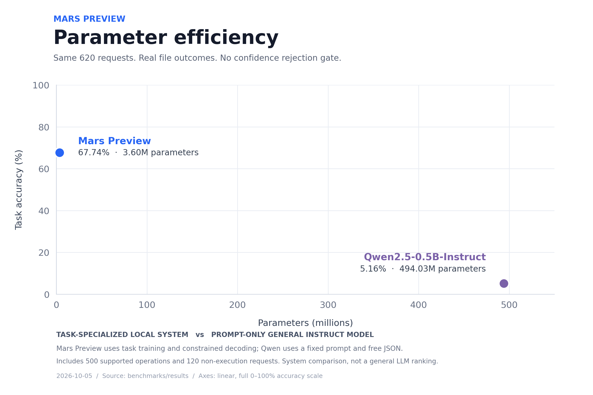
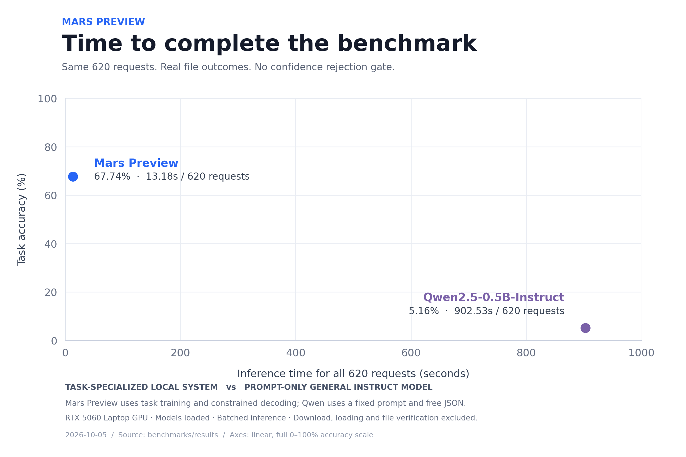

# Mars Preview

**360 万参数，让中文请求变成本地文件操作。**

Mars Preview 是一套本地运行的 **Filter–Translator** 模型与 Agent 框架，包含训练好的权重和浏览器工作台 **Dave Work**。公开版本仍处于实验预览阶段。

## 两个小模型，分工协作

- **Filter（约 27 万参数）**：从上下文中找出文件名、路径和正文，用 `{1}`、`{2}` 等占位符保存绑定。候选自身的文字不进入该候选的分类评分。
- **Translator（约 333 万参数）**：小型 Transformer，根据抽象后的请求规划操作、参数对应和顺序，参数原文不进入它的输入。
- **Dave Work**：负责绑定真实参数、校验路径、展示预览并执行。模型负责规划，用户核对后点击执行。

```text
把叫做草稿.txt的文件改名为最终版.txt
              ↓ Filter
把叫做{1}的文件改名为{2}
              ↓ Translator
fs.rename(source=SLOT_1, new_name=SLOT_2)
              ↓ Dave Work
绑定参数 → 预览 → 点击执行
```

支持列目录、读写文本、搜索、创建、追加、复制、移动、重命名、回收和恢复。首版面向常见中文文件请求，最多 256 个字符、4 个步骤、8 个参数；不处理跨轮指代、PDF/OCR或自由编程。

## 同题对照

双方处理相同的 **620 个中文文件请求**，按实际文件结果与不执行行为计分。图中关闭置信拒绝门槛，拒绝本应完成的请求仍计为错误。





这是文件任务系统的对照，并非通用语言能力排名：Mars Preview 经过专项训练并使用约束解码；Qwen2.5-0.5B-Instruct 使用固定提示词、5 个示例和自由 JSON 输出，没有专项训练或重试，协议输出错误明显影响成绩。

时间为同一台 RTX 5060 Laptop GPU 上完成整套题的推理时间，不含下载和模型加载，也不是单句延迟。题集是实验室样本，其中 580 题此前重复验收过，不代表真实用户总体成功率。实际工作台保留置信拒绝和执行前预览。

## 快速开始

使用 Python 3.9–3.12，在 Windows PowerShell 中运行：

```powershell
git clone https://github.com/DDD423/Mars-Preview.git
cd Mars-Preview
python -m venv .venv
.venv\Scripts\python.exe -m pip install -r requirements.txt
.\run_dave_work.ps1
```

浏览器打开后选择工作区，输入中文请求，核对参数和计划，再点击执行。模型支持 CPU 或 CUDA；终端仅作为手动工具，使用当前用户权限。

开源内容包括自研权重、模型与训练源码、Dave Work 和[工具协议](davework/PROTOCOL.md)。

代码与自研权重采用 [MIT License](LICENSE)。
